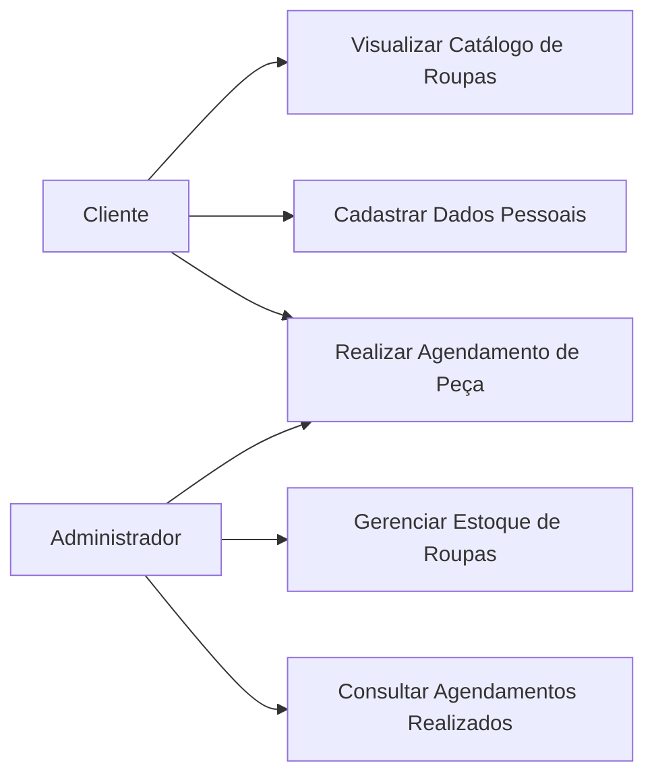
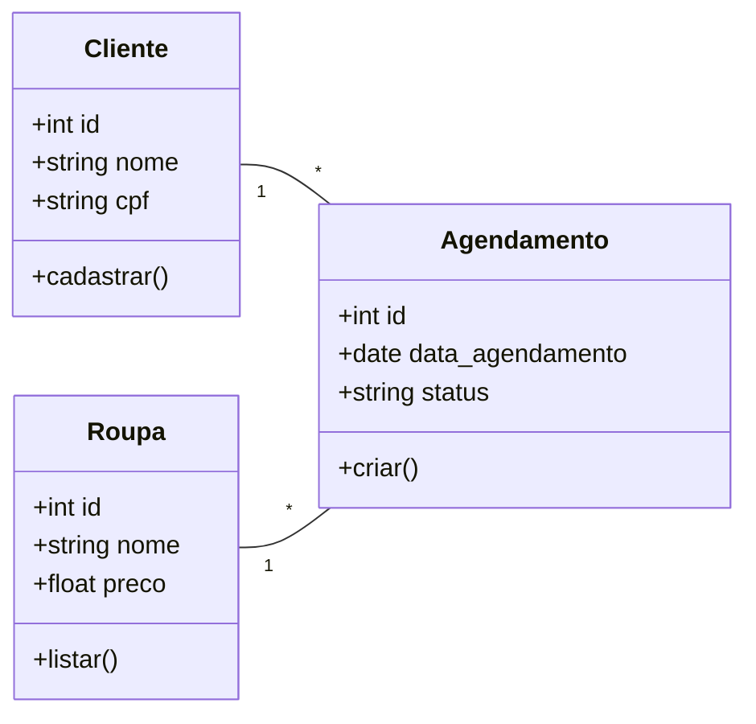

# ATELIER — Sistema de Catálogo e Agendamentos
> Plataforma web para pequenos empreendedores do setor de vestuário

---

## 📂 Estrutura do Projeto

```
atelier/
├── index.html                   ← Front-end (SPA completo)
├── config/
│   ├── database.php             ← Configuração PDO / Singleton
│   └── setup.sql                ← Script de criação do banco + dados de exemplo
├── models/
│   ├── ClienteModel.php         ← CRUD de clientes
│   ├── RoupaModel.php           ← Catálogo de roupas
│   └── AgendamentoModel.php     ← Agendamentos e verificação de conflitos
├── controllers/
│   ├── ClienteController.php    ← Valida e cadastra clientes (JSON API)
│   ├── RoupaController.php      ← Lista roupas (JSON API)
│   └── AgendamentoController.php← Cria/consulta agendamentos (JSON API)
└── README.md
```

---

## ⚙️ Requisitos

| Tecnologia | Versão mínima |
|-----------|--------------|
| PHP       | 8.1+         |
| MySQL     | 5.7+ / MariaDB 10.3+ |
| Servidor  | Apache / Nginx / php -S |

---

## 🚀 Instalação

### 1. Banco de Dados

```sql
-- Execute o arquivo setup.sql no seu MySQL:
mysql -u root -p < config/setup.sql
```

Ou cole o conteúdo em ferramentas como **phpMyAdmin** ou **DBeaver**.

### 2. Configuração da Conexão

Edite `config/database.php` com suas credenciais:

```php
define('DB_HOST', 'localhost');
define('DB_USER', 'seu_usuario');
define('DB_PASS', 'sua_senha');
define('DB_NAME', 'atelier_db');
```

### 3. Servidor Local

**Opção A — PHP built-in server (desenvolvimento):**
```bash
cd atelier/
php -S localhost:8080
# Acesse: http://localhost:8080
```

**Opção B — XAMPP/WAMP/Laragon:**
- Copie a pasta para `htdocs/` (XAMPP) ou `www/` (WAMP)
- Acesse: `http://localhost/atelier/`

---

## 🎯 Funcionalidades



### 🛍️ Catálogo
- Grid responsivo com foto, nome, categoria e preço
- Filtro por categoria (chips interativos)
- Modal com detalhes completos da peça
- Botão direto para agendar a peça selecionada

### 👤 Cadastro de Clientes
- Formulário com validação **front-end** (JS) e **back-end** (PHP)
- Máscaras automáticas de CPF e telefone
- Validação de CPF com algoritmo oficial
- Detecção de cliente existente por CPF (sem duplicidade)

### 📅 Agendamento (3 passos)
1. **Escolher a peça** — grade visual de seleção
2. **Escolher data e horário** — slots de horário disponíveis
3. **Dados do cliente** — CPF com auto-preenchimento se já cadastrado

Ao final: **confirmação visual** com todos os detalhes do agendamento.

---

## 🔒 Segurança

- **Prepared Statements** com PDO em todas as queries (proteção contra SQL Injection)
- **Validação dupla** — front-end (UX) e back-end (segurança)
- **Sanitização** de inputs antes da persistência

---

## 🎨 Design

- Paleta editorial de moda: creme, grafite, dourado, blush
- Tipografia: **Cormorant Garamond** (display) + **DM Sans** (corpo)
- Layout responsivo (mobile-first)
- Animações suaves com CSS transitions

---

## 📡 API Endpoints

| Método | URL | Ação |
|--------|-----|------|
| GET  | `controllers/RoupaController.php?action=listar`              | Lista roupas |
| GET  | `controllers/RoupaController.php?action=detalhe&id=X`        | Detalhe de peça |
| POST | `controllers/ClienteController.php?action=cadastrar`         | Cadastra cliente |
| POST | `controllers/AgendamentoController.php?action=criar`         | Cria agendamento |
| GET  | `controllers/AgendamentoController.php?action=buscar&id=X`   | Busca agendamento |

Todas as respostas são em **JSON**.

---

## 🗄️ Modelo de Dados


clientes          roupas
─────────         ──────────
id (PK)           id (PK)
nome              nome
cpf (UNIQUE)      descricao
telefone          preco
criado_em         imagem_url
                  categoria
                  ativo

agendamentos
────────────────
id (PK)
cliente_id (FK → clientes.id)
roupa_id   (FK → roupas.id)
data_agendamento
horario
status
observacoes
criado_em


